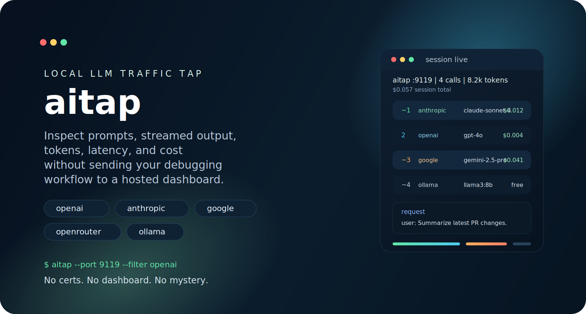

<div align="center">
  

  <h1>aitap</h1>
  <p><strong>Turn invisible LLM traffic into a living terminal session.</strong></p>
  <p>
    aitap is a local-first proxy and terminal UI for inspecting LLM API calls in real time.
    Watch prompts, streamed output, token counts, latency, and estimated cost without wiring
    up a hosted dashboard or wrapping your app with extra instrumentation.
  </p>

  <p>
    <a href="#quickstart">Quickstart</a>
    &middot;
    <a href="#why-aitap">Why aitap</a>
    &middot;
    <a href="#traffic-modes">Traffic modes</a>
    &middot;
    <a href="#development">Development</a>
    &middot;
    <a href="CONTRIBUTING.md">Contributing</a>
  </p>
</div>

> aitap is for the moment when your agent is "doing something weird" and logs are not enough.
> Put it between your app and the model provider, then inspect every call as it happens.

## Why aitap

| What you get | Why it matters |
| --- | --- |
| Live terminal session view | See requests and responses while your app is running |
| No dashboard required | Everything stays local unless you explicitly export a session |
| Zero-cert forward proxy mode | Point your SDK at localhost and start inspecting immediately |
| Streaming-aware parsing | Follow SSE responses while tokens arrive |
| Cost and token estimates | Spot runaway prompts before they become expensive |
| Single binary workflow | Easy to install, easy to share, easy to remove |

## Quickstart

### Install

```bash
# Go install
go install github.com/aniketjoshi/aitap/cmd/aitap@latest

# Or build from source
git clone https://github.com/aniketljoshi/aitap.git
cd aitap
go build -o bin/aitap ./cmd/aitap
```

### Run

```bash
aitap
```

By default, aitap listens on `:9119`.

## Traffic Modes

aitap supports two ways to sit in the middle of your traffic.

### 1. Forward proxy mode

This is the recommended mode.

Your SDK points to `localhost`, aitap strips the provider prefix, and the request is forwarded to
the real upstream API. No TLS interception. No certificate setup.

```bash
# Terminal 1
aitap

# Terminal 2
export OPENAI_BASE_URL=http://localhost:9119/openai/v1
export ANTHROPIC_BASE_URL=http://localhost:9119/anthropic
export GOOGLE_API_BASE=http://localhost:9119/google
export OPENROUTER_BASE_URL=http://localhost:9119/openrouter/api/v1
export OLLAMA_HOST=http://localhost:9119/ollama

python my_agent.py
```

### 2. HTTP proxy mode

Use this when your client already supports `HTTP_PROXY`, especially for plain HTTP traffic such as
local Ollama.

```bash
aitap

# In another terminal
export HTTP_PROXY=http://127.0.0.1:9119
python my_agent.py
```

> [!IMPORTANT]
> HTTPS traffic sent through a CONNECT tunnel is passed through but not inspected. If you want
> deep request and response visibility for hosted providers, use forward proxy mode.

## What You See

```text
 aitap  :9119  |  4 calls  |  8.2k tokens  |  $0.057

  ~   1 | anthropic | claude-sonnet-4...   |   1.2k>890 | $0.012 |  2.3s
      2 | openai    | gpt-4o               |    340>210 | $0.004 |  1.1s
  ~   3 | google    | gemini-2.5-pro       |   4.1k>1.5k| $0.041 |  4.7s
  ~   4 | ollama    | llama3:8b            |    890>450 |   free |  3.2s

  -- Request --
  system: You are a helpful coding assistant.
  user: Summarize the latest PR changes and suggest next steps.

  -- Response --
  assistant: Here are the key changes and the tradeoffs to watch...

  status=200  in=890  out=450  cost=free  latency=3.2s

  j/k navigate  enter expand  q quit
```

## Supported Providers

| Provider | Forward proxy | HTTP proxy detection | Streaming | Estimated cost |
| --- | --- | --- | --- | --- |
| OpenAI | Yes | Yes | Yes | Yes |
| Anthropic | Yes | Yes | Yes | Yes |
| Google | Yes | Yes | Yes | Yes |
| OpenRouter | Yes | Yes | Yes | Yes |
| Ollama | Yes | Yes | Yes | Free or local |

> [!NOTE]
> Cost estimates come from the model pricing map in `internal/provider/detect.go`. If provider
> pricing changes, the estimate may need to be updated in the repo.

## CLI

```bash
aitap
aitap --port 8080
aitap --export session.jsonl
aitap --redact
aitap --filter openai
aitap --filter anthropic
aitap --filter google
aitap --filter openrouter
aitap --filter ollama
aitap --version
```

## What Makes It Different

| Instead of this | aitap does this |
| --- | --- |
| Full observability platform setup | Start one local binary and inspect traffic now |
| SDK-specific logging | Works at the HTTP layer across providers |
| MITM certificate dance | Uses a cleaner forward-proxy path for local development |
| Post-hoc JSON dumps | Gives you a live terminal timeline while calls stream |

## Project Map

```text
aitap/
|- cmd/aitap/            # CLI entrypoint and proxy server
|- internal/export/      # JSONL export
|- internal/model/       # Session and call models
|- internal/parser/      # Request, response, and SSE parsers
|- internal/provider/    # Provider detection and pricing
|- internal/redact/      # Secret masking for exports
|- internal/tui/         # Bubble Tea terminal interface
`- .github/              # CI and community templates
```

## Development

```bash
# Build
go build -o bin/aitap ./cmd/aitap

# Run tests
go test ./...

# Run directly
go run ./cmd/aitap
```

If you prefer the project shortcuts:

```bash
make build
make test
make run
```

## Contributing

Community docs live in the repo, not in someone's head:

- [Contributing Guide](CONTRIBUTING.md)
- [Code of Conduct](CODE_OF_CONDUCT.md)
- [Security Policy](SECURITY.md)
- [Support Guide](SUPPORT.md)
- [Changelog](CHANGELOG.md)

When you are ready to help:

- Open a bug, feature, or help issue from [GitHub issue templates](https://github.com/aniketljoshi/aitap/issues/new/choose)
- Use the repo's [pull request template](.github/PULL_REQUEST_TEMPLATE.md)
- Keep changes focused and include tests when behavior changes

## License

This project is licensed under the [MIT License](LICENSE).
